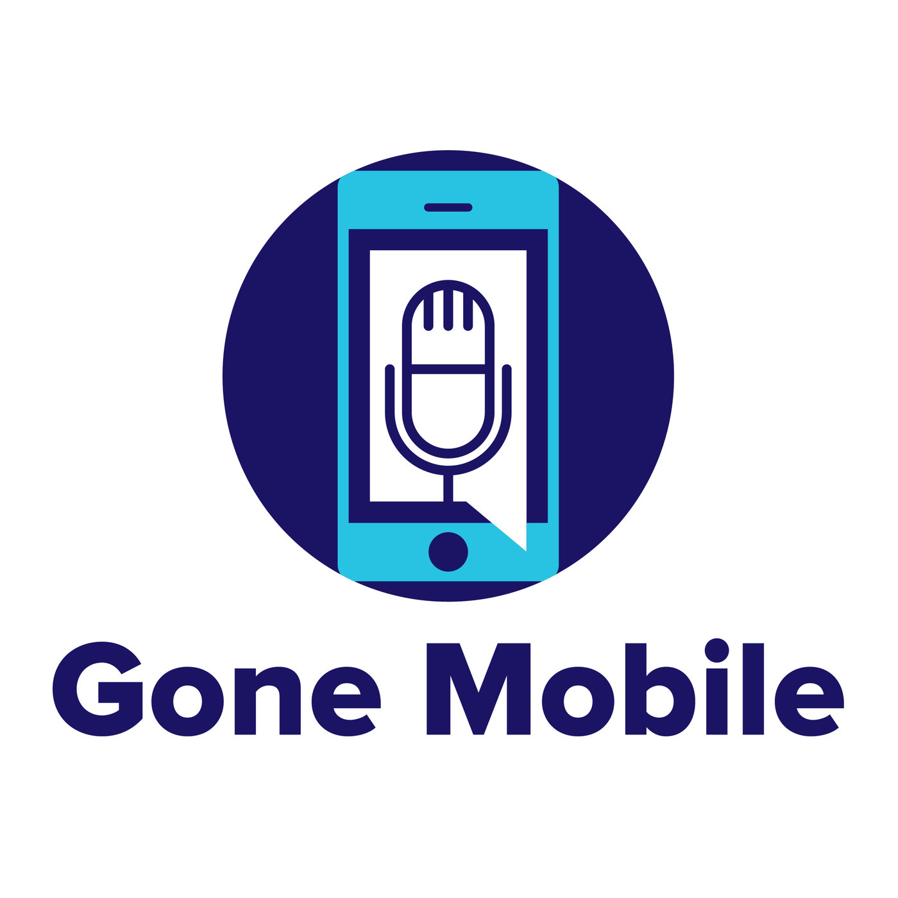

## Available For Hire :construction_worker:
Got a software project that needs some help?  I'm a .NET/Azure/Xamarin consultant with over 20 years of experience with all aspects of the software development lifecycle.  I can plug into existing teams & processes, write a project from scratch, or support your development project for whatever you may need.  Get in touch at [allan.ritchie@gmail.com](mailto:allan.ritchie@gmail.com)

**Please don't email me for free support.  I'm happy to help with general questions on GitHub issues, but if you need dedicated support or something beyond a standard FAQ - I offer paid consulting.**

* Shiny 
    * The biggest sweet of libraries for .NET MAUI than go beyond the `Essentials`
    * [Forums](https://github.com/shinyorg/shiny/discussions)
    * [Documentation](https://shinylib.net)
    * [Source Code](https://github.com/shinyorg/shiny)
    * Features
        * BluetoothLE Client & Host
        * Background Periodic Jobs
        * Background GPS & Geofencing
        * Background HTTP Uploads & Downloads 
        * Local Notifications
        * Microsoft Extensions Configuration Provider for Android & iOS
        * Push Notifications - The only one that allows you to swipe between native/firebase/azure
* Shiny Mediator
    * [GitHub](https://github.com/shinyorg/mediator)
    * [Documentation](https://shinylib.net/client/mediator/)
    * [End to End Sample](https://github.com/shinyorg/mediatorsamples/)
* [Talks](https://github.com/aritchie/talks)

## Paid Consulting
I am no longer offering 1-1 per hour consulting.  If you're looking for multi-hour help on a project, please contact me at allan.ritchie@gmail.com

## About Me 👋
* I'm a software engineering consultant living in Toronto, Canada - I hate cold weather though :)
* I build a lot of open source for .NET/C#/Azure/Xamarin as shown below
* I am a Microsoft MVP and a former Xamarin MVP from when that was a thing
* I have two black belts (karate & taekwondo)
* I love American Football 🏈

 
 &nbsp;

Listen to [Redth - Jon Dick - MAUI ](https://github.com/) & I every week for .NET content on:

## Sponsor Me :heart:
I work hard on open source and for the community in general.  If you use Shiny in a professional project, please consider sponsoring my work at  [GitHub Sponsorship](https://github.com/sponsors/aritchie).  

Becoming a sponsor gives you premium access to:
* [Sponsor Connect](https://sponsorconnect.dev)
* The Prism & Shiny official discord server where you can engage with other community authors as well as the library maintainers
* Voting priority on issues and enhancement requests
* Early Access to premium Shiny libraries as they become available

## Connecting
* 
* [LinkedIn](https://www.linkedin.com/in/allan-ritchie-44b58b3/) 

